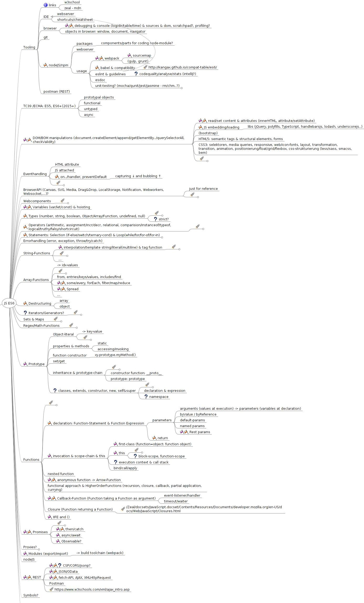

Kursleitfaden & Semesterplan "JavaScript ES6+"
========================

# Ziele
Grundlagen zu Nutzung und Verständnis eines JS-Frameworks

# Voraussetzungen
* ÜK101, ÜK307, (M133)

# Inhaltsübersicht

# Unterrichtsprinzipien
* möglichst viel selbständig erarbeiten - einzel oder im zweier-Team
* Austausch im Plenum (Lösungswege)
* Themeninput oder Themenworkshop
* Themenressourcen, Exercises, Checkfragen und Begleitprojekt - Dinge in Einzelarbeit eher ausserhalb der Kurslektion erarbeiten
* Fortschrittsübersicht und Arbeitsergebnisse als Portfolio - gelegentliche Kurzreviews durch LP oder gegenseitiger Resultatevergleich der LL (voneinander Lernen, analog den Kata-Sites)
* Fragen als Issues in Teacher GIT
* Vorgehensschritte: Informieren, Planen, Entscheiden, Realisieren, Kontrollieren, Auswerten -> Pendenzenliste (optional)
* keine Prüfungen - Zertifikat mit Inhaltsübersicht und ggf. besuch/erfolgreich/ausgezeichnet

# Ressourcen - Ablagestruktur
## GIT
* In diesem Kurs verwenden wir bewusst native JavaScript und keine Frameworks oder Libraries (jQuery, Lodash, Underscore..)
* Teacher GIT-Repo (dieses hier): enthält Modulleitfaden, Themenmaterialien/Exercises
* persönliches GIT-Repo (dein eigenes): enthält aktualisierte Kopie von Teacher GIT plus bearbeiteten Modulleitfaden (Lernmap), Themenseite (Resultateliste) und Resultate. Dieses Repo kann als Submodule in den students/-Ordner eingebunden werden, damit andere LL und die LP einfacher darauf zugreifen können.

## Klassenshare
* enthält Medien für klassenInternen Gebrauch

## Infrastruktur
in Linux-VM (smartlearn oder gemäss Tutorial) oder auf persönlichem Laptop:
* GIT Repos
* Chrome-Browser
* IDE (zB. WebStorm oder IntelliJ [https://www.jetbrains.com/idea/download/](https://www.jetbrains.com/idea/download/))
* NodeJS/npm (später)
* Zeal Docs [https://zealdocs.org/download.html](https://zealdocs.org/download.html)

# Semesterplan & Lernmap (Fortschrittsübersicht)

| KW | Kapitel | Themen | Unterlagen | Niveau | Aufwand |Plan Beginn | Status |
| --- | --- | --- | --- | --- | --- | --- | --- |
| xx | 01 | Einstieg: Infrastruktur & Organisation | [Themenübersicht](../01_infrastructure/README.md) | basic | 3h | 6.9.18 | open / *work in progress / done |
| xx | 02 | DOM & Events | [Themenübersicht](../02_dom_events/README.md) | basic| tbd | 13.9.18 | *open / work in progress / done |
| xx | 03 | Variables & Scope, Types, Operators, Statements| [Themenübersicht](../03_var_type_ops_stmt/README.md) | basic| tbd | 13.9.18 | *open / work in progress / done |
| xx | 04 | String, TemplateString | [Themenübersicht](../04_string/README.md) | basic| tbd | 13.9.18 | *open / work in progress / done |
| xx | 05 | Array & Iterables | [Themenübersicht](../05_array/README.md) | basic| tbd | 13.9.18 | *open / work in progress / done |
| xx | 06 | Spread | [Themenübersicht](../06_spread/README.md) | basic| tbd | 13.9.18 | *open / work in progress / done |
| xx | 07 | Set & Map | [Themenübersicht](../07_set_map/README.md) | basic| tbd | 13.9.18 | *open / work in progress / done |
| xx | 08 | Object, Prototype | [Themenübersicht](../08_object_prototype/README.md) | basic| tbd | 13.9.18 | *open / work in progress / done |
| xx | 09 | Class | [Themenübersicht](../09_class/README.md) | basic| tbd | 13.9.18 | *open / work in progress / done |
| xx | 10 | Destructuring | [Themenübersicht](../10_destructure/README.md) | basic| tbd | 13.9.18 | *open / work in progress / done |
| xx | 11 | Webcomponents | [Themenübersicht](../11_webcomponents/README.md) | basic| tbd | 13.9.18 | *open / work in progress / done |
| xx | 12 | Function | [Themenübersicht](../12_function/README.md) | basic| tbd | 13.9.18 | *open / work in progress / done |
| xx | 13 | ArrowFunction | [Themenübersicht](../13_arrowfcn/README.md) | basic| tbd | 13.9.18 | *open / work in progress / done |
| xx | 14 | Callback | [Themenübersicht](../14_callback/README.md) | basic| tbd | 13.9.18 | *open / work in progress / done |
| xx | 15 | Scope & this | [Themenübersicht](../15_scope_this/README.md) | basic| tbd | 13.9.18 | *open / work in progress / done |
| xx | 16 | Closure | [Themenübersicht](../16_closure/README.md) | basic| tbd | 13.9.18 | *open / work in progress / done |
| xx | 17 | IIFE | [Themenübersicht](../17_iife/README.md) | basic| tbd | 13.9.18 | *open / work in progress / done |
| xx | 18 | Async & Promise | [Themenübersicht](../18_async_promise/README.md) | basic| tbd | 13.9.18 | *open / work in progress / done |
| xx | 19 | Modules, nodeJS, webpack | [Themenübersicht](../19_modules_buildchain/README.md) | basic| tbd | 13.9.18 | *open / work in progress / done |
| xx | 20 | REST | [Themenübersicht](../20_rest/README.md) | basic| tbd | 13.9.18 | *open / work in progress / done |

# Meine Planung
[Meine Planung](planning_todo.md) (optional)
